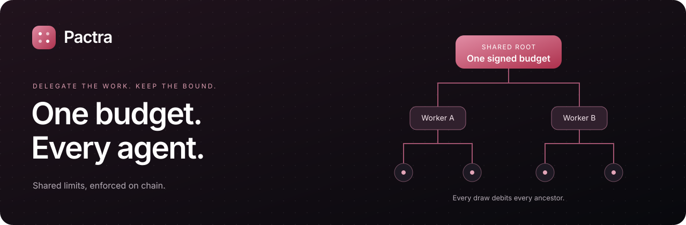
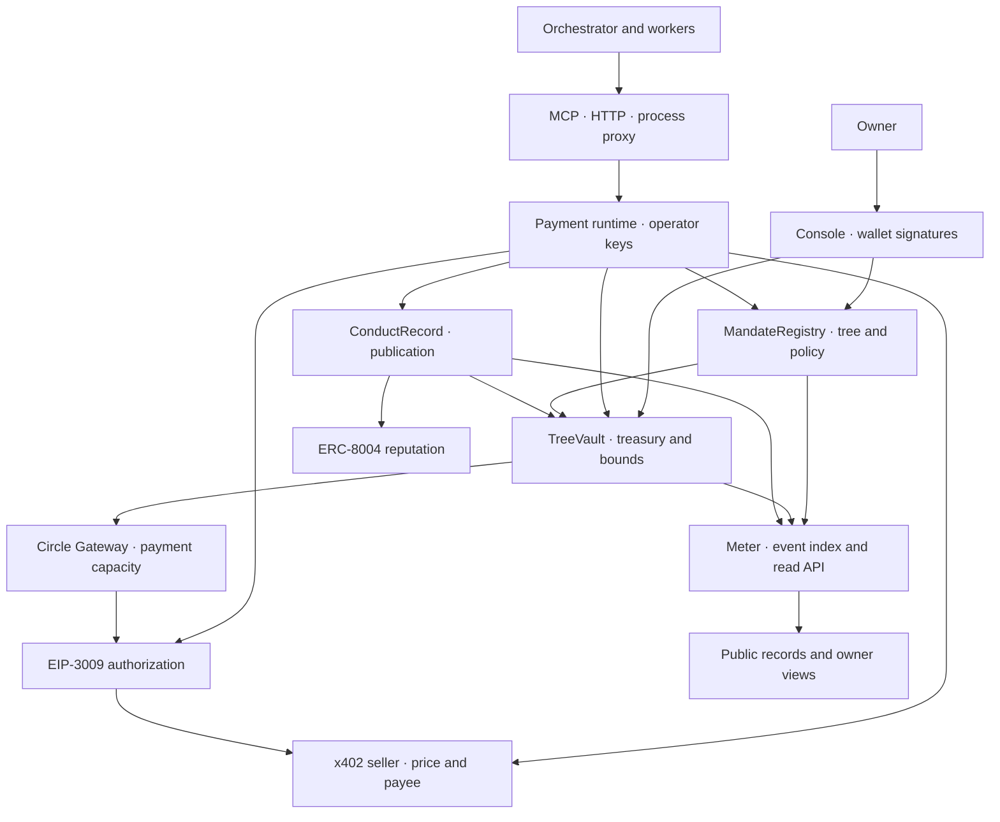

<div align="center">



# Pactra

### One budget for a tree of agents, enforced on chain.

Delegate work across an agent team without multiplying its spending authority.
Every accepted draw debits the requesting node and every ancestor up to the root.
Agent-facing tools never receive the operator's private key.

[](packages/contracts/foundry.toml)
[](packages/contracts/deployments/5042002.json)
[](#quick-start)
[](packages/daemon/package.json)
[](#integration-paths)
[](#settlement-and-the-record)
[](#settlement-and-the-record)
[](LICENSE)

[Preview](https://pactra.pages.dev) · [Documentation](https://pactra.pages.dev/docs) · [Owner console](https://pactra.pages.dev/console/) · [Architecture PDF](docs/Pactra-System-Architecture-and-User-Workflows.pdf)

**Maintained by [SomeshTalligeriDEV](https://github.com/SomeshTalligeriDEV)**

</div>

> **Project status:** Arc testnet implementation. Deployment addresses, recorded experiments, and validation reports are checked into the repository. Historical results are evidence from specific runs, not an audit or a guarantee about a new deployment. The preview address above is the configured project URL; service availability was not independently verified for this README update.

## Contents

[Overview](#overview) · [The solution](#the-solution) · [Architecture](#architecture) · [The mandate](#the-mandate) · [Bounds and refusals](#bounds-and-refusals) · [Deployment](#deployment) · [Quick start](#quick-start) · [Owner workflow](#owner-workflow) · [Integration paths](#integration-paths) · [HTTP API](#http-api) · [Settlement and the record](#settlement-and-the-record) · [Evidence and testing](#evidence-and-testing) · [Scope and limitations](#scope-and-limitations) · [Tech stack](#tech-stack) · [Repository structure](#repository-structure) · [Self-hosting](#self-hosting) · [Roadmap](#roadmap) · [Contributing](#contributing) · [License](#license)

## Overview

An orchestrator starts four workers. Each worker is allowed to spend $5. Every worker stays within its own limit, but together they can spend $20—even if the owner intended the entire task to cost no more than $10.

Delegation creates this gap: a collection of valid local limits does not automatically enforce a shared total.

**Pactra makes the tree the unit of spending authority.** An owner signs a root mandate. Workers and their children receive narrower mandates beneath it. Before the runtime obtains a payment tranche, the vault evaluates the requesting node and every ancestor. A child's purchase still counts against what the owner authorized at the root.

Pactra is intended for an owner operating a team of agents under a controlled payment runtime. Agents discover resources and request URLs; the runtime holds operator keys, reads the seller's payment challenge, and requests bounded capacity from the contract.

### What changes compared with an isolated per-agent limit?

| Property | Isolated per-agent limit | Pactra mandate tree |
| --- | --- | --- |
| Scope | One agent's allowance | A node and all spending below it |
| Delegation | Requires an additional shared-accounting policy | Children inherit constraints and debit ancestors |
| Enforcement | Depends on the wallet or application | Smart-contract checks at draw time |
| Agent key access | Depends on the integration | No operator key exposed through agent tools |
| Rejected draw | Integration-specific | Stored refusal with a reason and breached node |
| Owner intervention | Integration-specific | Revoke a branch or explicitly release a refusal |

This comparison describes isolated limits, not every wallet product. A wallet or service with equivalent shared accounting can address parts of the same problem.

## The solution

1. **Authorize once.** The owner opens a root mandate defining its window budget, lifetime cap, tranche cap, concentration limit, delegation depth, and operator.
2. **Delegate within that authority.** Children cannot widen their parent's bounds. Window duration must match the parent's.
3. **Ask for a resource.** The agent requests a URL through MCP, HTTP, or the process proxy. It does not submit a direct transfer instruction.
4. **Read the seller's challenge.** The runtime obtains the price and declared payee from the seller's x402 response.
5. **Evaluate the full path.** `TreeVault` checks the requesting node and all ancestors before committing spending debits.
6. **Accept or record a refusal.** Accepted draws debit the path and release capacity. A policy refusal returns a structured result and records an on-chain event instead of reverting away the evidence.
7. **Settle and publish.** Payment settlement and ERC-8004 publication are subsequent runtime operations; they are distinct from the vault's decision.

## Architecture



| Component | Responsibility |
| --- | --- |
| `MandateRegistry` | Stores immutable mandate parameters, delegation relationships, and revocations. |
| `TreeVault` | Holds treasury, evaluates bounds, debits ancestors, and stores refusals and owner releases. |
| `ConductRecord` | Derives publishable conduct evidence from refusals and releases. |
| Daemon / MCP runtime | Holds operator keys, handles seller challenges, executes draws, settles payments, and attempts publication. |
| Meter | Rebuildable event index and read API; the chain remains the source of authority. |
| Console | Owner signing flows: open, fund, spawn, withdraw, revoke, and release. |
| Public site | Product explanation, case studies, documentation, and record views. |

### One purchase, end to end

```mermaid
sequenceDiagram
    actor Agent
    participant Runtime as Pactra runtime
    participant Seller as x402 seller
    participant Vault as TreeVault
    participant Rail as Gateway / settlement
    Agent->>Runtime: Fetch URL
    Runtime->>Seller: Request resource
    Seller-->>Runtime: 402 challenge: amount and payee
    Runtime->>Vault: Draw for node and declared payee
    Vault->>Vault: Evaluate node and every ancestor
    alt Bounds pass
        Vault-->>Runtime: Accepted draw; ancestors debited
        Runtime->>Rail: Obtain payment capacity
        Runtime->>Seller: Retry with payment authorization
        Seller-->>Runtime: Resource response
        Runtime-->>Agent: Result
    else Bound fails
        Vault-->>Runtime: Stored refusal and reason
        Runtime->>Runtime: Attempt conduct publication
        Runtime-->>Agent: Structured refusal
    end
```

For trust boundaries, state ownership, recovery paths, and known risks, read the [system architecture](docs/Pactra-System-Architecture-and-User-Workflows.md) or its [PDF edition](docs/Pactra-System-Architecture-and-User-Workflows.pdf).

## The mandate

Policy is set when a mandate opens. A wider policy requires a new mandate rather than editing the existing one.

| Field | Meaning | Primary enforcement |
| --- | --- | --- |
| `budget6` | Maximum draw capacity per window for the subtree | Vault window accounting |
| `windowSeconds` | Duration of each accounting period | `TreeVault._roll` |
| `lifetimeCap6` | Maximum cumulative draws over the mandate's lifetime | Vault lifetime accounting |
| `trancheCap6` | Maximum size of one draw | Vault evaluation |
| `concentrationBps` | Maximum window share for a declared counterparty | Per-node counterparty accounting |
| `maxDepth` | Maximum delegation depth | Registry spawn validation |
| `operator` | Address authorized to act for the node | Registry and vault authorization |

Amounts ending in `6` use six-decimal USDC units: `1000000` represents one USDC. Concentration uses basis points: `10000` represents 100%.

**Windows are tumbling periods, not a continuously trailing window.** The implementation advances a window by whole `windowSeconds` intervals. A child must use its parent's window duration; shortening a child's window would create a faster refill schedule.

```text
Root:   $20 per window ───────────┐
└─ Worker: $8 ──────────────┐     │
   └─ Helper: $3 ─────┐    │     │
                      └────┴─────┘
A $1 helper draw charges $1 to all three nodes.
```

`TreeVault.headroom(node)` reports available capacity and the node limiting it. Headroom alone does not guarantee a purchase will pass: tranche and counterparty-specific checks still apply.

## Bounds and refusals

| Reason | Meaning |
| --- | --- |
| `revoked` | This node or an ancestor has been revoked. |
| `tranche-cap` | The requested draw exceeds a permitted tranche size. |
| `window-budget` | The current window is exhausted on the path. |
| `lifetime-cap` | A lifetime allowance on the path is exhausted. |
| `concentration` | The declared recipient exceeds its permitted window share. |
| `vault-balance` | Policy permits the draw, but treasury cannot fund it. |

Ancestor evaluation is the shared-accounting mechanism; it is not a separate refusal reason. A refusal identifies both the failed check and the node that imposed the bound.

A policy refusal does not consume spending allowance. It can still consume transaction gas and incur publication work. Repeating an unchanged refused request is not a recovery strategy.

## Deployment

The checked-in [Arc testnet deployment](packages/contracts/deployments/5042002.json) records chain `5042002`, deployment time **17 September 2026**, and starting block `62518670`.

<!-- PACTRA_DEPLOYMENT_TABLE_START -->
| Contract | Recorded address |
| --- | --- |
| MandateRegistry | `0x5a0a521cd083a3e884dc024c90898589751292b8` |
| TreeVault | `0x6a37c9506740d4d59e343cbbf8d7c2f56aa112eb` |
| ConductRecord | `0xa8bcdda003cddfb672a33e23a0bb375b6bed4a9f` |
<!-- PACTRA_DEPLOYMENT_TABLE_END -->

Use the deployment JSON when configuring a service; this table is a documentation snapshot. ERC-8004 registry addresses, USDC, and Gateway addresses are recorded there too. Historical experiment fixtures may refer to earlier deployments.

The project targets **testnet**. Current source still contains `pactra.example` placeholders, including `ConductRecord.RECORD_BASE`; configure and review these before a new deployment. Changing the README or web host does not change a URL compiled into a deployed contract.

## Quick start

### Requirements

- **Node.js 23.6+** for running TypeScript service entry points directly.
- **npm**; each package has its own manifest and lockfile.
- **Foundry** for contract compilation and tests.
- **OpenSSL** when using the HTTPS process proxy.
- A configured wallet provider, Arc testnet funds, and a deployed mandate for signing and payment flows.

### Run the website and console

From the repository root, install and start each frontend in its own terminal:

```bash
# Terminal 1 — website, docs, and public records
npm ci --prefix packages/site
npm run dev --prefix packages/site
```

```bash
# Terminal 2 — owner's console
npm ci --prefix packages/console
npm run dev --prefix packages/console
```

| Surface | Default local address |
| --- | --- |
| Product site | `http://localhost:5274/` |
| Case studies | `http://localhost:5274/#case-studies` |
| Documentation | `http://localhost:5274/docs` |
| Console through the site proxy | `http://localhost:5274/console/` |
| Direct console development server | `http://localhost:5173/console/` |

The landing page is static HTML, CSS, and vanilla JavaScript. Existing docs and application routes use the Vite application. Use the integrated development server for the full product; a bare HTML server cannot serve the console or arbitrary application routes. See [landing integration](packages/site/LANDING.md).

Configure `VITE_PRIVY_APP_ID` for the console's wallet flow. Read-only browsing is separate from signing; starting the frontend alone does not configure a funded payment runtime.

## Owner workflow

### 1. Generate operator keys

```bash
npm ci --prefix packages/daemon
npm run init --prefix packages/daemon -- --nodes 4
```

The initializer writes `~/.pactra/pactra.env` with mode `0600` and prints public operator addresses. An ordinary second initialization refuses to overwrite an existing key file.

### 2. Open and fund a root

Open `/console/new`, connect the owner's wallet, and select an operator address generated in step 1. Sign the mandate, then fund its treasury through the console. Funding requires approval and deposit transactions. Operators also need testnet gas.

### 3. Associate keys with node IDs

Edit the matching `PACTRA_NODE_<label>` entries in the key file to contain the registry's node IDs. These IDs are not wallet addresses. Keep each ID paired with the key for that node's operator.

To inspect only the node-ID lines:

```bash
rg '^PACTRA_NODE_' "$HOME/.pactra/pactra.env"
```

Do not paste the key file into client configuration, screenshots, issues, or chat.

### 4. Configure the daemon

Create `packages/daemon/.env.live` using addresses from the deployment JSON:

```dotenv
PACTRA_VAULT=<TreeVault address>
PACTRA_REGISTRY=<MandateRegistry address>
PACTRA_RECORD=<ConductRecord address>
PACTRA_RPC=https://rpc.testnet.arc.io
PACTRA_PORT=8402
PACTRA_KEY_FILE=/absolute/path/to/.pactra/pactra.env
```

Replace the placeholders, then start the runtime:

```bash
node --env-file=packages/daemon/.env.live \
     --env-file="$HOME/.pactra/pactra.env" \
     packages/daemon/src/main.ts
```

Check `GET http://localhost:8402/status` before attempting a purchase. Confirm node IDs, operator addresses, mandate parameters, and headroom.

### 5. Delegate and purchase

Spawn a narrower child through the console or runtime. Runtime-created children receive generated operator keys; fund the new operator's gas and restart the runtime if enrollment or purpose publication needs to be retried.

Point an agent at MCP, HTTP, or the proxy, then request a testnet x402 resource. Confirm the draw and settlement separately. Do not assume a successful draw means the seller was paid.

### 6. Handle exceptions

The owner can revoke a branch, withdraw treasury, or release a specific refusal. A release is an explicit exception and does not erase the original refusal. To widen policy, create a new mandate with the intended bounds and migrate deliberately.

## Integration paths

| Your application | Integration | Agent-facing capability |
| --- | --- | --- |
| MCP-compatible client | Pactra MCP server | Fetch, status, and narrower child creation |
| Existing proxy-aware program | Process proxy | Existing HTTP requests pass through the gate |
| Custom application | Daemon HTTP API | Explicit resource request with a node ID |

### MCP: run from your checkout

This setup does not assume that a particular package version has been published to npm:

```bash
npm ci --prefix packages/mcp
```

```json
{
  "mcpServers": {
    "pactra": {
      "command": "/absolute/path/to/node",
      "args": ["/absolute/path/to/PACTRA/packages/mcp/src/main.ts"],
      "env": {
        "PACTRA_ENV_FILE": "/absolute/path/to/PACTRA/packages/daemon/.env.live,/absolute/path/to/.pactra/pactra.env",
        "PACTRA_MCP_NODE": "0x<mandate-node-id>"
      }
    }
  }
}
```

Use actual absolute paths; MCP clients do not expand shell variables in JSON. The server loads the named environment files, and the private key remains outside the model's tool inputs. The MCP entry point uses the same gate and settlement logic; it does not require a separately running HTTP daemon.

| Tool | Purpose |
| --- | --- |
| `pactra_fetch` | Request a URL, optionally with a method and body. |
| `pactra_status` | Read capacity and the limiting node. |
| `pactra_spawn` | Create a narrower child with a stated purpose. |

`pactra_transfer`, `pactra_pay`, and `pactra_send` are intentionally absent. Read the generated [agent instructions](packages/mcp/SKILL.md) and [MCP package guide](packages/mcp/README.md) for tool schemas and refusal handling.

### Process proxy

```bash
npm ci --prefix packages/proxy
node packages/proxy/src/run.ts --node 0x<mandate-node-id> -- python3 agent.py
```

The wrapper configures proxy variables and an ephemeral certificate authority for the child process. It does not install a system-wide CA. Applications that bypass proxy settings are outside this integration's coverage.

### HTTP resource request

```bash
curl -sS http://localhost:8402/fetch \
  -H 'content-type: application/json' \
  -d '{"node":"0x<mandate-node-id>","url":"https://<your-testnet-seller>/resource"}'
```

A structured refusal is returned as HTTP `200`, because it is a valid policy decision rather than a transient server failure. Malformed requests and operational failures are separate cases.

## HTTP API

### Payment daemon — default port `8402`

| Method and path | Request / result |
| --- | --- |
| `GET /status` | Configured nodes, headroom, and mandate details. |
| `POST /fetch` | `{ node, url, method?, headers?, body? }`; obtain a resource and handle its payment challenge. |
| `POST /spawn` | `{ node, budget6, trancheCap6, concentrationBps, lifetimeCap6?, purpose? }`; generate a child operator and spawn within parent bounds. |

The spawn endpoint does not accept a caller-supplied operator. Pass integer base-unit amounts as strings when serializing large values in JSON. Zero does not mean unlimited.

### Meter — default port `8404`

| Method and path | Result |
| --- | --- |
| `GET /health` | Indexer health and indexed range. |
| `GET /tree/:root` | A root's delegation tree and figures. |
| `GET /node/:node` | One indexed node. |
| `GET /agent/:agentId` | Conduct by ERC-8004 identity. |
| `GET /refusals?root=&limit=&before=` | Paginated refusals. |
| `GET /refusal/:id` | Refusal and publication information. |
| `GET /reconcile` | Operator balances compared with released capacity. |

Production routes commonly expose the meter beneath `/api/`. Indexer data can lag the chain and should not be used as an authorization decision.

### Attestation seller — default port `8405`

| Method and path | Result |
| --- | --- |
| `GET /health` | Seller health and terms. |
| `GET /attest/:agentId` | Paid conduct snapshot using x402 `exact`. |

The repository also includes a demonstration seller under `packages/attest` for a separately priced Arc snapshot.

## Settlement and the record

**A draw and a payment are different events.** The vault controls the capacity it releases. Gateway and the seller then complete the payment path, including the EIP-3009 authorization. A failed settlement can leave capacity debited without a completed purchase.

Counterparty concentration applies to the payee declared to the vault. The final recipient inside an off-chain payment signature is not independently enforced by the vault. Aggregate reconciliation is not a per-purchase commitment ledger.

**A stored refusal and a published record are also different events.** `ConductRecord` supports ERC-8004 publication derived from refusal data. Publication requires configuration, identity binding, gas, and successful execution. A missing external registry entry does not imply that the vault allowed the draw.

The meter exposes the resulting history. An owner's release is additional evidence, not deletion of the initial refusal.

## Evidence and testing

### Recorded evidence gates

The [gate fixture](packages/fixtures/src/gates.gen.ts) contains these historical results. All are recorded as green there; this README update did not rerun them or validate them against the current deployment.

| Gate | What it checks | Recorded date |
| --- | --- | --- |
| G1 | Tree arithmetic and ancestor debits | 2026-09-11 |
| G2 | Live Arc tree and refusal checks | 2026-09-11 |
| G3 | Hostile spending drill | 2026-09-10 |
| G4 | Contract-scored adversarial search | 2026-09-08 |
| G5 | Refusal persistence and authority boundaries | 2026-09-08 |
| G6 | Conduct publication integrity | 2026-09-08 |
| G7 | Task completion under spending constraints | 2026-09-09 |

The G3 fixture records **0.007 USDC of draw authority reached against a 0.02 USDC ceiling: 35%**. It predates wired settlement and must not be presented as verified seller spend. See the [drill fixture](packages/fixtures/src/drill.gen.ts), [search fixture](packages/fixtures/src/search.gen.ts), and [evaluation fixture](packages/fixtures/src/eval.gen.ts) for the underlying runs.

The [17 September validation report](docs/validation.json) records **98 contract tests and 193 runtime tests passing**. These are saved validation results, not a live CI badge. Separate reports cover [landing-page checks](docs/landing-validation.json) and [Case Studies routing](docs/case-studies-validation.json).

### Run the suites

Install each package's dependencies before running its suite. Contract tests require the repository's Foundry dependencies.

```bash
# Solidity
cd packages/contracts
forge test
```

From the repository root:

```bash
npm test --prefix packages/daemon
npm test --prefix packages/meter
npm test --prefix packages/attest
npm test --prefix packages/proxy
npm test --prefix packages/mcp
npm test --prefix packages/eval
npm test --prefix packages/fixtures

npm run build --prefix packages/site
npm run build --prefix packages/console
```

Browser verification is available in `scripts/browser_check.cjs`. It requires Playwright and Chrome; set `PACTRA_PLAYWRIGHT` to the installed Playwright module and `PACTRA_TEST_URL` to the integrated preview. Its default module path is specific to the development environment.

## Scope and limitations

- **Controlled funding boundary.** Money or wallets supplied to an agent outside Pactra do not become bounded by Pactra.
- **Trusted runtime.** Keeping keys away from the model does not make the daemon trustless. Operator key compromise remains material.
- **Declared recipient.** Vault concentration accounting does not verify the final off-chain payment recipient.
- **Non-atomic settlement.** Draw, settlement, and record publication can succeed or fail independently.
- **Network exposure.** The daemon/proxy interfaces do not provide application-level caller authentication. Restrict them to trusted access; the daemon listener is not explicitly bound to loopback in `main.ts`.
- **Testnet evidence.** Historical fixtures are not production telemetry, and old transaction records are not proof of the current deployment's behavior.
- **Immutable publication URLs.** Source-level URL placeholders need attention before deployment; a web redirect cannot rewrite deployed contract constants.

The full [architecture risk register](docs/Pactra-System-Architecture-and-User-Workflows.md#14--architecture-risk-register--trust-boundaries-and-limitations) documents these boundaries and additional recovery gaps.

## Tech stack

| Layer | Technology | Role |
| --- | --- | --- |
| Contracts | Solidity 0.8.28, Foundry, EVM Shanghai | Mandates, treasury, bounds, and conduct records |
| Chain | Arc testnet, chain `5042002` | Contract execution and public transaction evidence |
| Asset | USDC, six-decimal ERC-20 view | Budget and payment accounting |
| Payment protocols | x402 `exact`, EIP-3009, EIP-712, Circle Gateway | Challenges, authorizations, and settlement |
| Runtime | Node.js, TypeScript, viem | Operators, chain calls, services, and reconciliation |
| Agent interface | Model Context Protocol SDK, HTTP, process proxy | Integration with clients and programs |
| Public landing | HTML, CSS, vanilla JavaScript | Video hero, product sections, and case studies |
| App interfaces | React 18, Vite, Framer Motion, Privy | Docs, records, owner workflows, and wallet integration |
| Identity / reputation | ERC-8004 | Agent identities and conduct publication |
| Operations | nginx, systemd, deployment scripts | Routing, service supervision, and publishing |

## Repository structure

```text
packages/
  contracts/   Solidity contracts, deployment manifests, Foundry suites
  daemon/      Operator keys, draws, seller challenges, settlement, HTTP API
  mcp/         MCP server, three tools, generated agent instructions
  proxy/       Process wrapper and HTTP/HTTPS proxy
  meter/       Event index, read API, reconciliation
  attest/      Paid conduct endpoint and demonstration seller
  eval/        Task-completion evaluation
  fixtures/    Shared constants and recorded experiment artifacts
  site/        Static landing, documentation, public records
  console/     Owner dashboard and signing workflows
  ui/          Shared component and styling system
  brand/       Brand assets and generation
ops/           Hosting configuration and deployment scripts
scripts/       Repository utilities and browser checks
docs/          Architecture, PDF, validation reports, README artwork
```

Shared fixtures centralize service and application data. The static landing also contains rendered snapshots; update and validate them when changing the corresponding source sections or recorded results.

## Self-hosting

Read [operations](ops/README.md) before publishing. The repository includes nginx/systemd configuration and AWS/static deployment helpers under `ops/aws/`.

```bash
# Build and publish using an already configured operations host
ops/bin/pactra-publish.sh

# Validate that host's configured public surfaces
ops/bin/pactra-check.sh
```

These are deployment commands, not prerequisites for local browsing. Review their target paths and configured origins before running them.

Preserve the route split: the root serves the static landing, application routes use the app entry point, `/console/` serves the console bundle, and `/api/` reaches the meter. Public static hosting alone does not run the daemon, meter, or sellers. For contract deployment, inspect [the deployment script](packages/contracts/script/deploy.sh) and use an encrypted keystore rather than putting a private key in a shell command.

## Roadmap

Planned work, rather than features claimed as complete:

- Improve recovery and observability across draw, settlement, and publication.
- Add authenticated service access and strengthen deployment boundaries.
- Replace placeholder publication origins in future deployments.
- Improve reconciliation from declared recipients to independently observed settlement evidence where the rail permits it.
- Refresh static product snapshots and public evidence automatically from versioned fixtures.
- Evaluate broader deployment and cross-organization delegation after the trust and operational assumptions are addressed.

## Contributing

Open an issue describing the problem, reproduction steps, and affected package. For changes, include the relevant tests and update fixtures or documentation when behavior changes. Do not commit operator keys, wallet exports, or environment files containing secrets.

**Suggested GitHub topics:** `pactra`, `ai-agents`, `agentic-ai`, `solidity`, `evm`, `arc`, `usdc`, `x402`, `erc-8004`, `mcp`, `typescript`, `agent-payments`, `spending-controls`.

### Third-party components and attribution

Dependencies and versions are declared in the package manifests and lockfiles, including viem, the MCP SDK, React, Vite, Framer Motion, Privy, and Foundry tooling. Circle Gateway and the ERC-8004 registries are external systems, not services owned by this project. Preserve dependency licenses and notices.

See [AI usage](packages/AI_USAGE.md) for the repository's tooling disclosure and [the architecture report](docs/Pactra-System-Architecture-and-User-Workflows.md) for the documented rebrand and assessment history.

## License

[MIT](LICENSE) · Copyright © 2026 **SomeshTalligeriDEV**.
